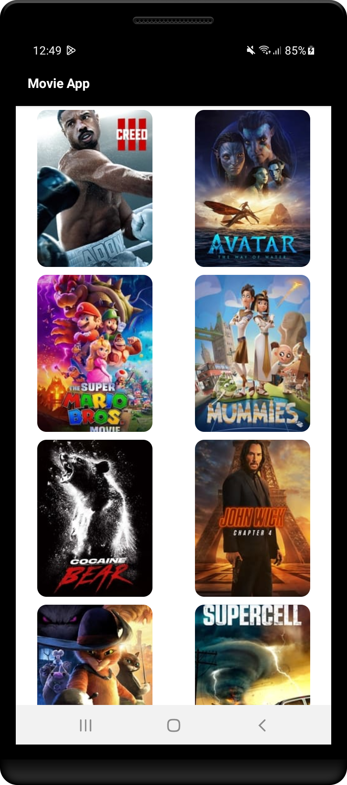
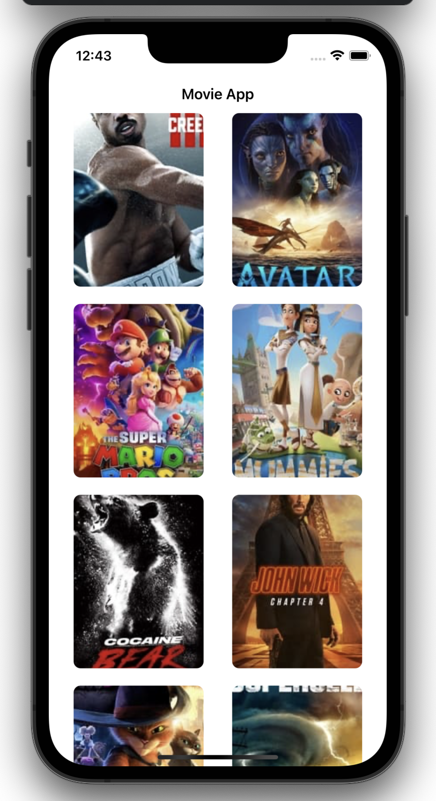

# kmm-movieapp
This app demonstrate that how Kotlin Multiplatform Mobile SDK can be used to develop cross platform mobile app that works on both Android and iOS platforms.

# About 
Kotlin Multiplatform SDK allows to write cross platform mobile app that runs on Android and iOS platforms. This movie app
app is using the common shared module to use business logic. Here, network layer is implemented as a shared module and will be used as follow in Android and iOS projects. 
KMM is trusted in production by many of the world’s leading companies, including Philips, Netflix, Leroy Merlin, and VMWare.

## 1. Android App
Android app is build just like another native Android app where the app app module is using the shared module created by KMM project. It will get data from the MovieSDK class that is present in shared module.
- UI - Android UI is designed by using Jetpack Compose.
- Business Logic - Using business logic implemented in shared module.

## 2. iOS App
An iOS app is using the shared module as a regular framework to use business logic.
- UI - iOS app UI is designed by using SwiftUI.
- Business logic - Using business logic implemented in shared module.

## 3. Shared Module
The common module being used by both Android and iOS applications. We have implemented network layer in this module which is calling TMDB movie API to get movie data.
The consumer of this module can interact via exposed public API. [MovieSDK](https://github.com/Sushant-Hande/kmm-movieapp/blob/main/shared/src/commonMain/kotlin/com/sushanthande/movieapp/MovieSDK.kt) class is an entry point for this module that consumer app will use.

# Built With
- [KMM SDK](https://kotlinlang.org/docs/multiplatform-mobile-getting-started.html) - Kotlin Multiplatform SDK that offers cross platform functionality.
- [Kotlin](https://kotlinlang.org) - Official programming language for Android application development by Google.
- [Android Material Components](https://github.com/material-components/material-components-android) - The material UI components for Android, designed and developed by Google.
- [Jetpack Compose](https://developer.android.com/jetpack/compose) - Android's modern toolkit for building native UI.
- [Swift](https://developer.apple.com/swift/) - A powerful and intuitive programming language for iOS, iPadOS, macOS, tvOS, and watchOS.
- [SwiftUI](https://developer.apple.com/xcode/swiftui/) - The declarative way of writing native UI for all apple platforms with the power of Swift.

# Screenshots
<table style="width:100%">
  <tr>
    <th>Android version</th>
    <th>iOS version</th>
  </tr>
  <tr>
    <td></td>
    <td></td>
  </tr>
</table>

# Contribution Guidelines
Please visit [issues](https://github.com/Sushant-Hande/kmm-movieapp/issues) section to find issue of your interest to work on.I have kept few issues open. Also, if you come across new issues or improvements don't forget to discuss it in issue section.
Please create a PR and let's discuss your fix or improvement.

License
========

    Copyright 2020 Sushant Hande

    Licensed under the Apache License, Version 2.0 (the "License");
    you may not use this file except in compliance with the License.
    You may obtain a copy of the License at

       http://www.apache.org/licenses/LICENSE-2.0

    Unless required by applicable law or agreed to in writing, software
    distributed under the License is distributed on an "AS IS" BASIS,
    WITHOUT WARRANTIES OR CONDITIONS OF ANY KIND, either express or implied.
    See the License for the specific language governing permissions and
    limitations under the License.